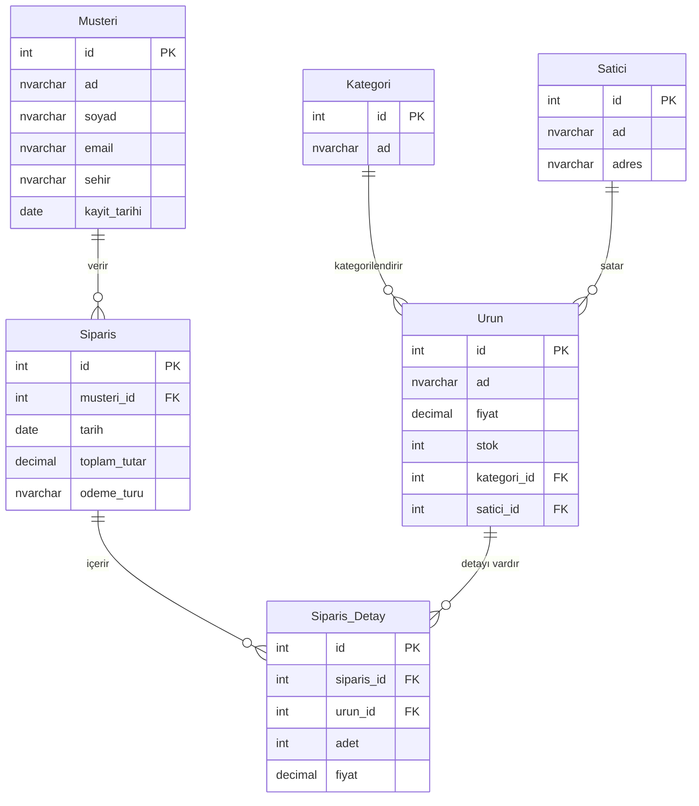

```mermaid
erDiagram
    Musteri {
        int id PK
        nvarchar ad
        nvarchar soyad
        nvarchar email
        nvarchar sehir
        date kayit_tarihi
    }

    Kategori {
        int id PK
        nvarchar ad
    }

    Satici {
        int id PK
        nvarchar ad
        nvarchar adres
    }

    Urun {
        int id PK
        nvarchar ad
        decimal fiyat
        int stok
        int kategori_id FK
        int satici_id FK
    }

    Siparis {
        int id PK
        int musteri_id FK
        date tarih
        decimal toplam_tutar
        nvarchar odeme_turu
    }

    Siparis_Detay {
        int id PK
        int siparis_id FK
        int urun_id FK
        int adet
        decimal fiyat
    }

    Musteri ||--o{ Siparis : "verir"
    Siparis ||--o{ Siparis_Detay : "içerir"
    Urun ||--o{ Siparis_Detay : "detayı vardır"
    Kategori ||--o{ Urun : "kategorilendirir"
    Satici ||--o{ Urun : "satar"
```